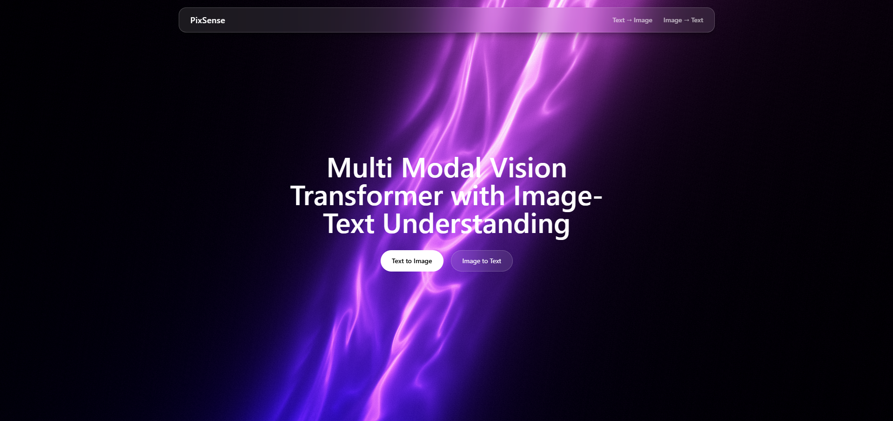
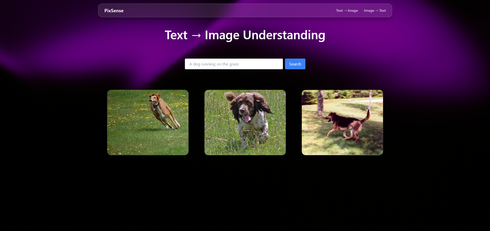
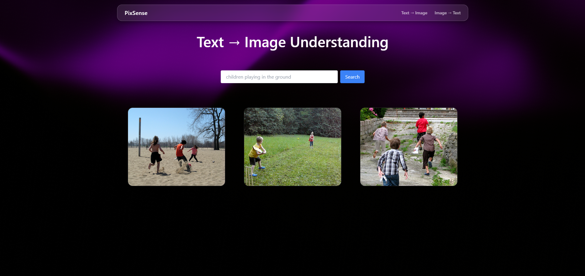
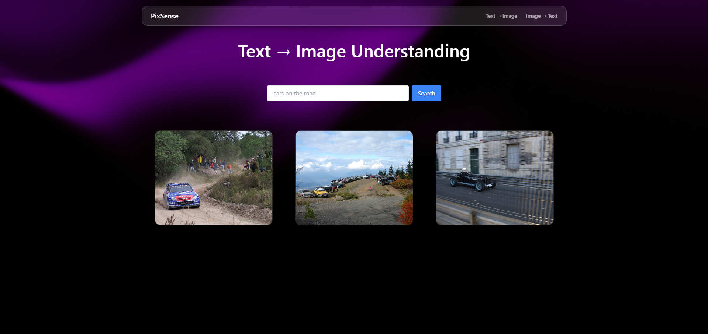
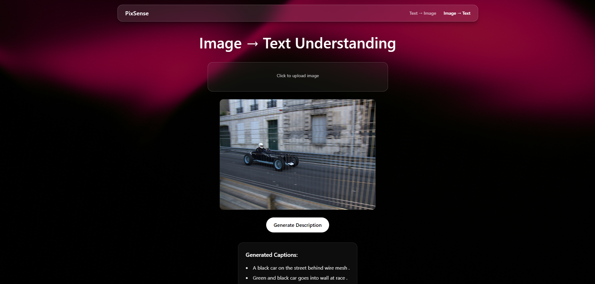
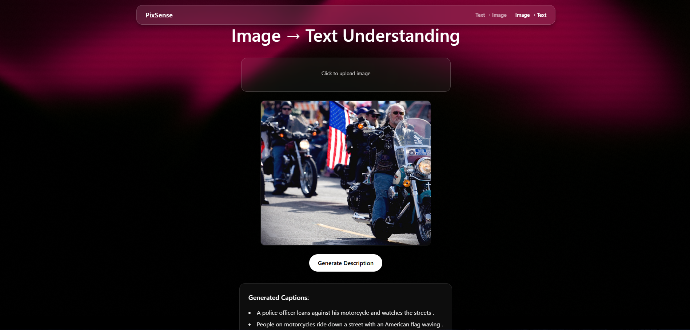

# Multi-Modal Vision Transformer for Image–Text Understanding

A deep learning–based **multimodal AI system** that learns relationships between **images and textual descriptions** using **Vision Transformers (ViT)** and **Transformer-based text encoders** with **contrastive learning**.

This project enables:
- **Image-to-Text Retrieval / Caption Generation**
- **Text-to-Image Retrieval**
- **Cross-Modal Semantic Understanding**
- **Interactive Web-Based UI**
- **Real-Time Inference using React + FastAPI**


---

# Project Screenshots

## 1. Landing Page




---

## 2. Text-to-Image Example 1



### Prompt Used
```txt
A Dog Running on the grass
```

---

## 3. Text-to-Image Example 2



### Prompt Used
```txt
Children Playing in the ground
```

---

## 4. Text-to-Image Example 3



### Prompt Used
```txt
Cars on the road
```

---

## 5. Image-to-Text Example 1




---

## 6. Image-to-Text Example 2


---

## 7. Image-to-Text Example 3




---

# Features

- Vision Transformer (ViT)–based Image Encoding
- Transformer-based Text Encoding
- Contrastive Learning for Shared Embedding Space
- Image Caption Retrieval
- Text-to-Image Semantic Matching
- Real-Time Frontend Interaction
- Responsive UI using Tailwind CSS
- Backend API using FastAPI
- CPU-Friendly Deployment

---

# System Architecture Overview

```text
User (Web Browser)
        ↓
React Frontend (Vite + Tailwind CSS)
        ↓ REST API
FastAPI / Flask Backend
        ↓
Vision Transformer (ViT)
        ↓
Transformer Text Encoder
        ↓
Shared Embedding Space
        ↓
Contrastive Learning & Similarity Matching
        ↓
Generated Caption / Retrieved Image
```

---

# Model Architecture

## Vision Encoder
- Vision Transformer (ViT)
- Patch-based image representation
- Self-attention mechanism

## Text Encoder
- Transformer-based encoder
- Context-aware text embeddings

## Embedding Space
- Shared vector representation
- Cosine similarity matching

---

# Dataset Used

## Flickr8k Dataset

- Dataset contains:
  - 8,000 images
  - Multiple captions per image
- Used for:
  - Image-to-text learning
  - Cross-modal embedding training

Dataset Link:
https://www.kaggle.com/datasets/adityajn105/flickr8k

---

# Tech Stack

## Frontend
- React.js
- Tailwind CSS
- Vite

## Backend
- Python
- FastAPI / Flask

## Machine Learning
- PyTorch
- Hugging Face Transformers
- NumPy
- Pandas

---

# Project Structure

```text
multimodal-vit-project/
│
├── frontend/
│   ├── src/
│   │   ├── components/
│   │   ├── pages/
│   │   ├── api/
│   │   └── App.jsx
│
├── backend/
│   ├── app.py
│   ├── model.py
│   ├── inference.py
│   ├── requirements.txt
│   └── checkpoints/
│
├── notebooks/
│   └── multimodal_vit_training.ipynb
│
├── screenshots/
│
└── README.md
```

---

# Running Locally

## Backend Setup

```bash
cd backend
pip install -r requirements.txt
uvicorn app:app --reload
```

Backend runs at:

```text
http://127.0.0.1:8000
```

---

## Frontend Setup

```bash
cd frontend
npm install
npm run dev
```

Frontend runs at:

```text
http://localhost:5173
```

---

# API Workflow

1. User uploads image or enters text
2. Frontend sends request to backend
3. Backend preprocesses input
4. ViT/Text encoder generates embeddings
5. Similarity matching is performed
6. Output is returned to frontend
7. Results displayed dynamically

---

# Improvements Made in Review III

- Optimized training pipeline
- Improved embedding consistency
- Reduced API latency
- Added image preview functionality
- Added loading indicators
- Enhanced UI responsiveness
- Improved result visualization
- Better frontend-backend integration

---

# Future Enhancements

- Larger dataset training
- Cloud deployment
- Real-time multimodal chat
- Advanced caption generation
- GPU optimization
- Multilingual text support

---

# Academic Context

- Domain:
  - Deep Learning
  - Computer Vision
  - Natural Language Processing
  - Multimodal AI

- Technology:
  - Vision Transformers
  - Contrastive Learning
  - Cross-Modal Retrieval

---

# Author

## Ajay Anand
VIT Vellore

GitHub:
https://github.com/AJrelapse

---

# Disclaimer

This project is developed for:
- Educational purposes
- Research purposes
- Academic implementation

The system is not intended for commercial production deployment.